<!--
  Animesh Basak · GitHub Profile
  Lead Frontend Engineer · AI Builder
  Updated: July 2026
-->

<p align="center">
  <picture>
    <source media="(prefers-color-scheme: dark)" srcset="assets/hero-dark.svg" />
    <source media="(prefers-color-scheme: light)" srcset="assets/hero-light.svg" />
    
  </picture>
</p>

<p align="center">
  <a href="https://animeshbasak.vercel.app/"></a>
  <a href="https://www.linkedin.com/in/animeshbasak/"></a>
  <a href="https://twitter.com/animeshsbasak"></a>
  <a href="https://www.instagram.com/insanemesh.ai/"></a>
</p>

<p align="center">
  
  
  
  
</p>

<p align="center"><i>Frontend systems that survive contact with 150M+ users.<br/>AI products that actually ship.</i></p>

<p align="center">
  
</p>

## ◢ About

Lead Frontend Engineer with **7+ years** building high-scale web platforms across **Telecom, Travel, Fintech, and Banking**. Currently leading frontend engineering at **Airtel Digital** — Airtel Thanks platform, ~150M MAU.

I architect for scale. Mentor for compounding. Ship product loops driven by experimentation and analytics. Outside work I build AI products end-to-end — agents, RAG systems, automated content pipelines. The side projects aren't a hobby; they're the proof of work.

> *"Software is a compression of intent. Every component is a hypothesis. Don't wait for permission to build."*

## ◢ Now — what's shipping this week

```diff
+ Lakshya       · "Verified Alive" job search live · 20+ board/ATS adapters · 730 tests passing
+ PAARTH Agent  · Phase 1 shipped — kernel router + safety gate + pluggable LLM brains · 380 tests
+ PAARTH        · v4 public on GitHub (ex-SuperAgent) · skill routing brain · ~95% token savings
~ Portfolio     · v6 "Type + Nerve" redesign live · accent picker + legacy toggle
* insanemesh    · zero-touch pipeline at 7PM IST
```

## ◢ Live AI Lab

> Four production AI products. Public. Indie. All shipping in the last 90 days.

<table>
<tr>
<td width="50%" valign="top">

### 🔴 Lakshya
**Unified AI Job Search OS**

"Verified Alive" job search — 20+ board/ATS adapters (Greenhouse, Lever, Ashby, Personio, Teamtailor…) with liveness checks · AI fit scoring · LaTeX-Article PDF resume engine · 730 tests passing.

`Next.js 16` · `Supabase SSR` · `Claude API` · `QStash` · `Sentry`

→ **Live:** [getlakshya.animeshbasak.com](https://getlakshya.animeshbasak.com/)

</td>
<td width="50%" valign="top">

### 🟠 PAARTH Agent
**Standalone LLM-agnostic Agent**

FRIDAY evolved: deterministic Python kernel (router + reversibility-aware safety gate + playbooks) with pluggable LLM brains — Anthropic / Groq / Ollama, tool-call repair for weak models. 380 tests passing.

`Python` · `Ollama` · `Anthropic` · `Groq` · `SafetyGate`

→ **Status:** Phase 2 next — MCP server face for every IDE

</td>
</tr>
<tr>
<td width="50%" valign="top">

### 🟢 PAARTH
**Cost-aware AI Routing Brain** *(ex-SuperAgent)*

v4 public release. Across **8 platforms** — Claude Code, Cursor, Copilot, Codex, Gemini CLI… Reads intent, scores all skills, picks the cheapest viable model, auto-invokes the chain. **~95% token savings.**

`Claude Code` · `Skills` · `Cost Brain` · `MCP` · `MIT`

→ **Public:** [github.com/animeshbasak/Paarth](https://github.com/animeshbasak/Paarth)

</td>
<td width="50%" valign="top">

### 🟣 insanemesh.ai
**Zero-touch AI Content Pipeline**

Gemini → Groq → Puppeteer → Telegram → Meta API. Fires at 7PM IST daily. Fully automated, zero human input. 90-day public AI build log.

`Gemini` · `Groq` · `Puppeteer` · `Meta API`

→ **Live:** [@insanemesh.ai](https://instagram.com/insanemesh.ai)

</td>
</tr>
</table>

## ◢ Mission Log

| Period | Company | Role | Highlight |
|---|---|---|---|
| **2025 →** | **Airtel Digital** | Lead Frontend Engineer | Owns React/TS architecture for **~150M MAU**. HLD + LLD with Architect sign-off. GrowthBook rollouts. V2L + Superset monitoring. |
| 2024 → 2025 | MakeMyTrip | Senior SWE II — Full Stack | Hotels funnel **Lighthouse 6 → 8–9**. Killed **1,000+ Sentry errors in 48h**. ~90% test coverage. |
| 2021 → 2024 | Paytm | Software Engineer | Legacy → React migration for **~3M merchants**. Soundbox revamp → **+40% EDC sales**. Sole Analytics SPOC. |
| 2021 | Sparklin | Frontend Developer | ICICI Internet Banking — Nirvana Project (Angular). |
| 2018 → 2021 | Infosys | Systems Engineer | FINACLE @ ANZ Bank. React + WebDriverIO regression automation. |

## ◢ Three pillars

<table>
<tr>
<td width="33%" valign="top">

**Frontend at scale**

React · TypeScript · Next.js 16 · SSR · Web Vitals · code splitting · GrowthBook rollouts · V2L + Superset monitoring · accessibility · banking UI

</td>
<td width="33%" valign="top">

**AI engineering**

Claude API · agentic systems · MCP tooling · RAG · prompt caching · cost-aware routing · multi-provider orchestration · arena/bidding · Ollama local-first

</td>
<td width="33%" valign="top">

**Systems thinking**

HLD + LLD with architect sign-off · experimentation frameworks · Sentry-driven observability · analytics that drive product decisions · resilient release pipelines

</td>
</tr>
</table>

## ◢ Stack

```text
Frontend     React · TypeScript · Next.js 16 · Redux · Zustand · Framer Motion
Backend      Node.js · Spring Boot · Supabase · Postgres · REST · Edge Functions
AI / LLM     Claude API · OpenAI · Gemini · Groq · Ollama · MCP · QStash
Performance  SSR · Lighthouse · Web Vitals · Code Splitting · Edge Caching
Tooling      Docker · Jenkins · GitHub Actions · Vercel · Webpack · Vite · Turbopack
```

<p align="center">
  
</p>

## ◢ Activity

<p align="center">
  
  
</p>

<p align="center">
  
</p>

<p align="center">
  
</p>

<p align="center">
  
</p>

## ◢ Connect

<p align="center">
  <a href="https://animeshbasak.vercel.app/"><b>Portfolio ↗</b></a>
  &nbsp;·&nbsp;
  <a href="https://www.linkedin.com/in/animeshbasak/"><b>LinkedIn</b></a>
  &nbsp;·&nbsp;
  <a href="https://twitter.com/animeshsbasak"><b>X</b></a>
  &nbsp;·&nbsp;
  <a href="https://www.instagram.com/insanemesh.ai/"><b>Instagram</b></a>
  &nbsp;·&nbsp;
  <a href="mailto:animeshsbasak@gmail.com"><b>Email</b></a>
</p>

<p align="center"><sub>📍 New Delhi, India · 28°36′N 77°12′E · Open to staff AI eng / lead frontend roles · <code>FILE_ID: AB-ENG-2026-001</code></sub></p>

<p align="center">
  
</p>


<p align="center">
  <a href="https://github.com/animeshbasak/Paarth">
    
  </a>
  &nbsp;
  
</p>

<p align="center"><sub>This README was authored by my own AI orchestration system — <a href="https://github.com/animeshbasak/Paarth"><b>PAARTH</b></a> — which routed the task across the right skills and shipped it.</sub></p>
